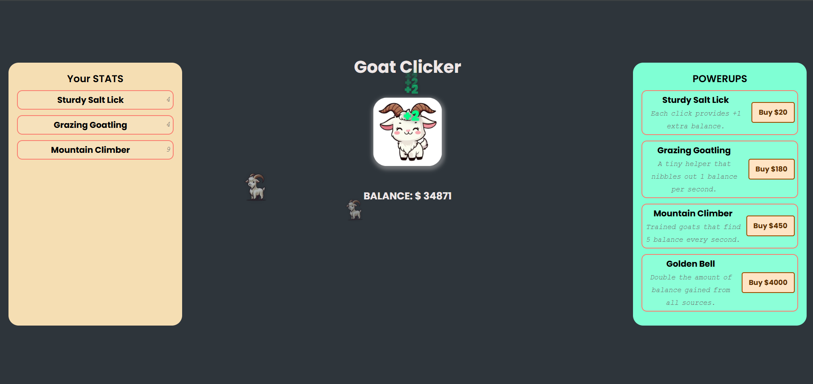

# Goated Website

An wonderful game to help releive stress. Built using **HTML**, **CSS**, and **JavaScript**, this is a goated website because you can click on the goat to increase your balance and buy different powerups.

## Features

- Animation on clicking the goat.
- Dynamic Shop pricing
- Amazing powerups.
- Local storage to save your game.
- Simple and intuitive UI design.
- **Special animation after your balance exceeds 1000**.

## Tech Stack

- **HTML**: For the structure of the web page.
- **CSS**: For styling and layout.
- **JavaScript**: For the functionality (adding, removing, and updating the stats, animation).

## Installation:
1. Clone the repository:
    ```bash
    git clone https://github.com/subodhgautam/Goated-Website.git
    ```

2. Navigate to `index.html` file to open in your browser to view the App.

   ## OR
    You can visit the site <a href="https://subodhgautam.github.io/Goated-Website/">here.</a>
 

<i> IMAGE: Final Result </i>


## License:
MIT License